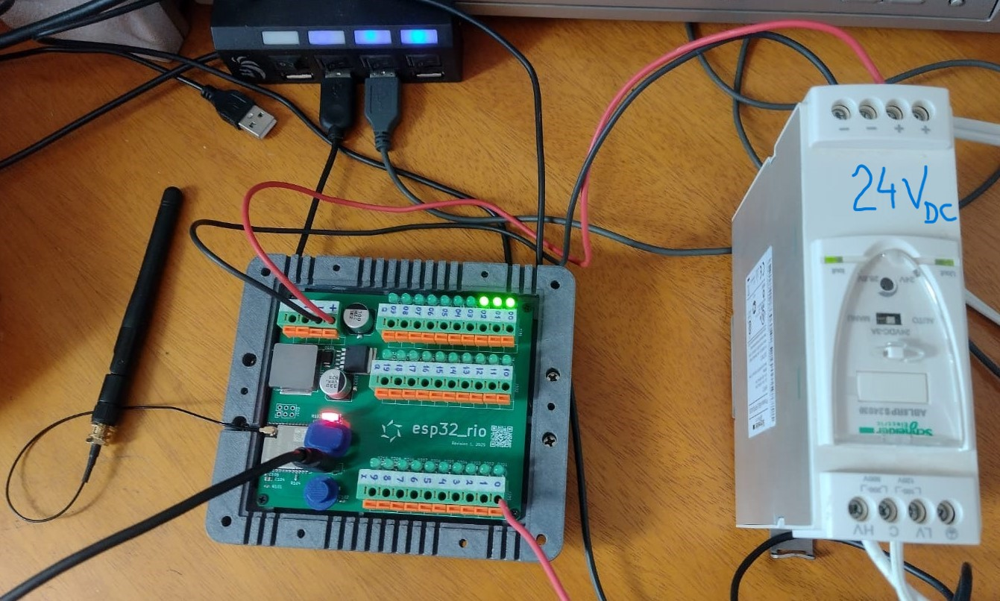

# 🚀 ESP32 – Modbus TCP + MQTT - Para esteira Industrial

Projeto desenvolvido para automatizar a esteira industrial do laboratorio de Automação Industrial da FEELT-UFU.
A esteira é basicamente discreta, possuindo entradas digitais de detecção de peça e saidas digitais pneumáticas e motores. As entradas e saidas digitais sao todas 24Vdc.

O módulo ESP32_RIO (Remote IO) cujo hardware e software desenvolvido pelo Douglas Almeida e esta detalhado no seguinte repositorio https://github.com/dougsthenri/esp32_rio.

Apesar do autor ter desenvolvido um codigo fonte Modbus TCP (usando ESP-IDF), foi alterado o codigo para ficar no padrão do laboratorio usando o codigo do Prof. Fabio Vincenzi com o codigo base deste repositório https://github.com/fabiovince/LinkBox

Portanto, Este código da ESP32_RIO foi desenvolvido usando **ESP32-S3-WROOM-1** utilizando **PlatformIO (VS Code)** e framework **Arduino**. O firmware integra comunicação **Modbus TCP Slave** e **MQTT** para aplicações de automação industrial.

---

## 📑 Sumário
- [Descrição](#-descrição)
- [Requisitos de Hardware](#-requisitos-de-hardware)
- [Requisitos de Software](#-requisitos-de-software)
- [Instalação e Uso](#-instalação-e-uso)
- [Configuração de Rede](#-configuração-de-rede)
- [Exemplo de Saída Serial](#-exemplo-de-saída-serial)
- [Estrutura do Projeto](#-estrutura-do-projeto)
- [Licença](#-licença)

---

## 📝 Descrição
O sistema foi desenvolvido para:
- Operar como **Modbus TCP Slave** em rede local.
- Publicar dados em **broker MQTT**.
- Permitir atualização OTA (Over-The-Air).
- Suporte a **diferentes BSPs** (módulo de motor, caixa de botões/LEDs, sensores).

---

## 🔧 Requisitos de Hardware
- ESP32-S3-WROOM-1 (montado em PCB própria)
- 10 Sensores digitais 24Vdc NA  (Nao isoladas)
- 20 Saidas digitais 24Vdc NA    (Nao isoladas)
- 1 Botão de reset
- 1 Botão de Enable/Disable Outputs 
- Fonte de alimentação 24Vdc
- Conexão Wi-Fi com IP Fixo (ver WIFI_CONN.cpp) com antena externa

---

## 💻 Requisitos de Software
- [PlatformIO](https://platformio.org/) (recomendado no VS Code)
- Framework **Arduino-ESP32**
- Bibliotecas:
  - `WiFi.h`
  - `PubSubClient.h` (para MQTT)
  - `ModbusIP_ESP8266.h` (ou equivalente ESP32)

## 🚨 ATENÇÃO – Problema conhecido no upload + Serial Monitor

❗ **Nunca faça upload com o Monitor Serial ligado no VSCode**.  
Isso trava a porta USB CDC e impede o download do firmware.

Checklist:
- ✅ Feche o Monitor antes de `Upload`.
- ✅ Reabra o Monitor somente depois da gravação.
- ⚠️ Se travar, pressione **BOOT + RESET** para forçar o modo bootloader.

