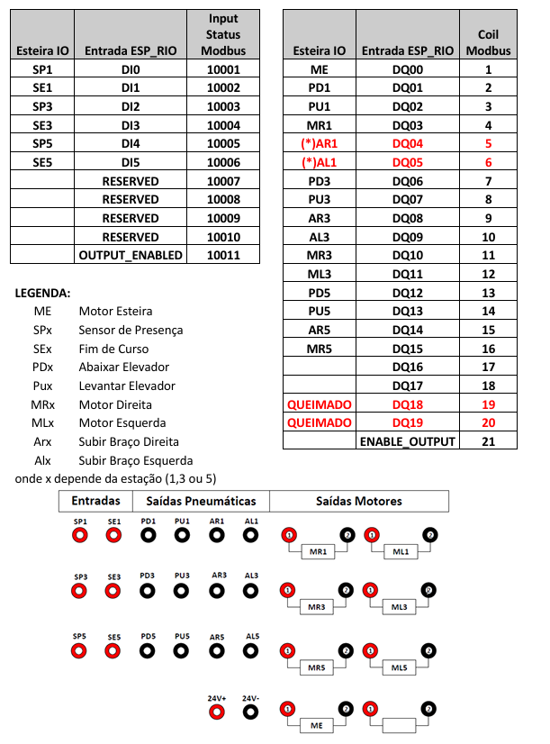

# 🚀 ESP32 – Modbus TCP + MQTT - Para esteira Industrial

Projeto desenvolvido para automatizar a esteira industrial do laboratorio de Automação Industrial da FEELT-UFU.
A esteira é basicamente discreta, possuindo entradas digitais de detecção de peça e saidas digitais pneumáticas e motores. As entradas e saidas digitais sao todas 24Vdc.

O módulo ESP32_RIO (Remote IO) cujo hardware e software desenvolvido pelo Douglas Almeida e esta detalhado no seguinte repositorio https://github.com/dougsthenri/esp32_rio.

Apesar do autor ter desenvolvido um codigo fonte Modbus TCP (usando ESP-IDF), foi alterado o codigo para ficar no padrão do laboratorio usando o codigo do Prof. Fabio Vincenzi com o codigo base deste repositório https://github.com/fabiovince/LinkBox

Portanto, Este código da ESP32_RIO foi desenvolvido usando **ESP32-S3-WROOM-1** utilizando **PlatformIO (VS Code)** e framework **Arduino**. O firmware integra comunicação **Modbus TCP Slave** e **MQTT** para aplicações de automação industrial.

---

## 📝 Descrição
O sistema foi desenvolvido para:
- Operar como **Modbus TCP Slave** em rede local.
- Publicar dados em **broker MQTT**.
- Permitir atualização OTA (Over-The-Air).
- Suporte a **diferentes BSPs** (módulo de motor, caixa de botões/LEDs, sensores).

---

## 🔧 Painel com ESP32-RIO
A esp32-RIO já está totalmente ligada a esteira e funciona via Modbus TCP através de comunicação sem fio (Wifi do laboratório). 
IP FIXO		192.168.0.248
SUB MASK	255.255.252.0
GATEWAY	192.168.0.1

Atenção!!! A esp32-RIO não é isolada e desta forma deve-se prevenir não ligar ela com a bancada do CLP em paralelo. 
Fique atento!!!! LED verde no painel indica fonte ESP32 Energizada (basta desligar a fonte da tomada!!!

Como ligar a esteira via Modbus TCP (usando a ESP32-RIO)

## 🔧 Como ligar a esteira no Painel

Os IOs disponíveis na caixa de bornes (fêmea) já estão todos conectados na esteira de acordo com a tabela acima. A figura acima mostra as borneiras disponíveis (a ligação tanto das entradas quanto das saídas é do tipo sink).

A única preocupação é com os motores. Neste caso, cada motor está associado a um relé. E deve ser alimentado os reles com 24V. Entao basta ligar um cabo banana do +24Vdc (borne vermelho) com o +VCC da entrada do relé (borne vermelho). Na figura abaixo mostra a ligação do motor ME principal da esteira, e o MR3 (motor da estação 3 para direita). O mesmo deve ser feito com cada um dos motores que se desejar ligar. Repare que os pinos pretos de cada motor não precisam de ligação externa pois já está interligado internamente na ESP-RIO. 

## 🚨 ATENÇÃO – Problema conhecido no upload + Serial Monitor

❗ **Nunca faça upload com o Monitor Serial ligado no VSCode**.  
Isso trava a porta USB CDC e impede o download do firmware.

Checklist:
- ✅ Feche o Monitor antes de `Upload`.
- ✅ Reabra o Monitor somente depois da gravação.
- ⚠️ Se travar, pressione **BOOT + RESET** para forçar o modo bootloader.

Aqui está o manual da esteira em formato pdf.

